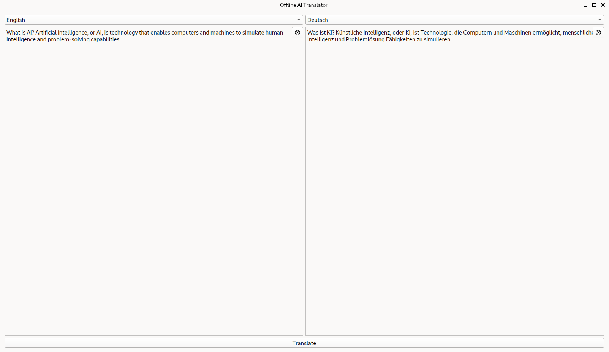

# Offline AI Translator

An Offline AI multilingual Translation software


## Build Setup

```bash
# Arch Linux
$ python -V && pip --version
$ sudo pacman -S git-lfs

# Ubuntu
$ python3 -V && pip3 --version
$ curl -s https://packagecloud.io/install/repositories/github/git-lfs/script.deb.sh | sudo bash
$ sudo apt install git-lfs

# Clone repository
$ git clone git@github.com:ncklinux/OfflineAITranslator.git
$ cd OfflineAITranslator
$ git checkout -b YOUR_BRANCH_NAME

# It is always recommended to use a virtual environment, use the following commands to manage libraries with pip
$ python -m venv .venv
$ source .venv/bin/activate
$ pip install pyqt6 torch transformers sentencepiece sacremoses qtawesome pyinstaller black
$ pip list
```

We use [Opus-MT](https://github.com/Helsinki-NLP/Opus-MT) models, based on [Marian-NMT](https://marian-nmt.github.io/), trained on [OPUS](https://opus.nlpl.eu/).

```bash
# Download models
$ cd language_models
$ git clone https://huggingface.co/Helsinki-NLP/opus-mt-en-de
$ cd opus-mt-en-de
$ git lfs install
$ git lfs pull
$ cd ..
$ git clone https://huggingface.co/Helsinki-NLP/opus-mt-de-en
$ cd opus-mt-de-en
$ git lfs install
$ git lfs pull
$ cd ../../
```

Run Transformers in a firewalled or offline environment and launch.

```bash
# Run Transformers with locally cached files by setting an environment variable
$ printenv
$ TRANSFORMERS_OFFLINE=1
$ echo $TRANSFORMERS_OFFLINE
# 1

# Launch and have fun :)
$ python main.py
```



## Motivation

The aim of the project is privacy protection :wink: There are many tools that can be used for Offline Translation, but as soon as you get back online, they will sync all data to remote servers. Use Wireshark and see for yourself, you will be surprised.

## License

GNU General Public License v3.0 - See the [LICENSE](https://github.com/ncklinux/OfflineAITranslator/blob/main/LICENSE) file in this project for details.

## Disclaimer

This project is currently under development, distributed FREE & WITHOUT ANY WARRANTY. Report any bugs or suggestions as an [issue](https://github.com/ncklinux/OfflineAITranslator/issues/new).

## Commit Messages

This repository follows the [Conventional Commits](https://www.conventionalcommits.org) specification, the commit message should never exceed 100 characters and must be structured as follows:

```
<type>[optional scope]: <description>

[optional body]

[optional footer(s)]
```

## Note

I will keep and maintain this project as open source forever! [Watch it](https://github.com/ncklinux/OfflineAITranslator/subscription), give it a :star: and follow me.
