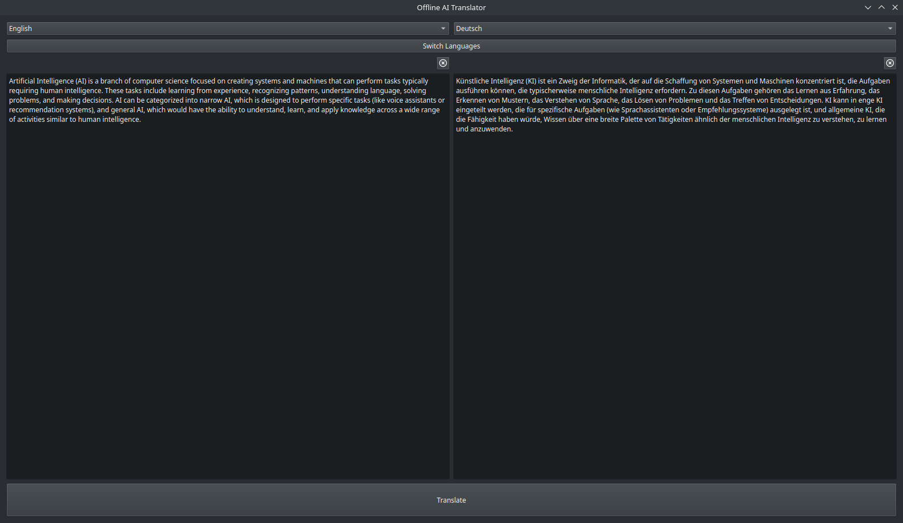
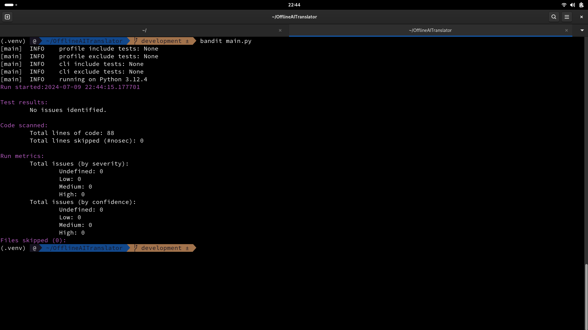

# Offline AI Translator

An Offline AI multilingual Translation software


## Build Setup

```bash
# Arch Linux
$ python -V && pip --version
$ sudo pacman -S git-lfs

# Ubuntu
$ python3 -V && pip3 --version
$ curl -s https://packagecloud.io/install/repositories/github/git-lfs/script.deb.sh | sudo bash
$ sudo apt install git-lfs

# Clone repository
$ git clone git@github.com:ncklinux/OfflineAITranslator.git
$ cd OfflineAITranslator
$ git checkout -b YOUR_BRANCH_NAME

# It is always recommended to use a virtual environment, use the following commands to manage libraries with pip (for Debian/Ubuntu use python3 and pip3)
$ python -m venv .venv
$ source .venv/bin/activate
$ pip install pyqt6 torch transformers sentencepiece sacremoses qtawesome pyinstaller black mypy flake8 bandit
$ pip list
```

We use [Opus-MT](https://github.com/Helsinki-NLP/Opus-MT) models, based on [Marian-NMT](https://marian-nmt.github.io/), trained on [OPUS](https://opus.nlpl.eu/).

```bash
# Download models
$ cd language_models
$ git clone https://huggingface.co/Helsinki-NLP/opus-mt-en-de
$ cd opus-mt-en-de
$ git lfs install
$ git lfs pull
$ cd ..
$ git clone https://huggingface.co/Helsinki-NLP/opus-mt-de-en
$ cd opus-mt-de-en
$ git lfs install
$ git lfs pull
$ cd ../../
```

Run Transformers in a firewalled or offline environment and launch.

```bash
# Run Transformers with locally cached files by setting an environment variable
$ printenv
$ TRANSFORMERS_OFFLINE=1
$ echo $TRANSFORMERS_OFFLINE
# 1

# Launch
$ python main.py
```



## Motivation

The aim of the project is privacy protection :wink: There are many tools that can be used for Offline Translation, but as soon as you get back online, they will sync all data to remote servers. Use [Wireshark](https://www.wireshark.org) and see for yourself, you will be surprised.

## Type Annotations

[Mypy](https://mypy-lang.org) is an optional static type checker for Python that aims to combine the benefits of dynamic (or "duck") typing and static typing. Mypy combines the expressive power and convenience of Python with a powerful type system and compile-time type checking. Mypy type checks standard Python programs; run them using any Python VM with basically no runtime overhead.

```bash
$ mypy --ignore-missing-imports main.py
$ mypy --ignore-missing-imports common/translator.py
# Success: no issues found in 1 source file
```

## Linting

Python linting, also known as code linting or static code analysis, is the process of analyzing Python code for potential errors, bugs, security and stylistic issues. The term "lint" comes from the idea of using a lint roller to remove tangled threads from fabric, and in this context, Python linting is like using a tool to "lint" or clean up your Python code to make it more readable, maintainable, and error-free.

- There are some linters out there, the most tried and tested is [Flake8](https://flake8.pycqa.org), "the wrapper which verifies pep8, pyflakes, and circular complexity", also has a low false positive rate.
- [Bandit](https://bandit.readthedocs.io/en/latest/) is a tool designed to find common security issues in Python code. To do this, Bandit processes each file, builds an AST from it, and runs appropriate plugins against the AST nodes. Once Bandit has finished scanning all the files, it generates a report.



## Formatting

[Black](https://pypi.org/project/black/) is the uncompromising Python code formatter. By using it, you agree to cede control over minutiae of hand-formatting. In return, Black gives you speed, determinism, and freedom from pycodestyle nagging about formatting. You will save time and mental energy for more important matters.

## Troubleshooting

If you encountered the following module error, in fact, any similar module error `No module named 'pip'`, see below for more details:

```bash
$ python main.py

# Traceback (most recent call last):
#   File ".venv/bin/pip", line 5, in <module>
#     from pip._internal.cli.main import main
# ModuleNotFoundError: No module named 'pip'
```

It turns out that Virtualenv is not up to date, use the following commands to fix the problem:

```bash
$ deactivate
$ rm -rf .venv
$ python -m venv .venv
$ source .venv/bin/activate
$ pip install ...
```

And reinstall all the PIP packages as you did at the [beginning](https://github.com/ncklinux/OfflineAITranslator?tab=readme-ov-file#build-setup) when you started with the program, then execute `python main.py` again, this time should work without module issues.

## License

GNU General Public License v3.0 - See the [LICENSE](https://github.com/ncklinux/OfflineAITranslator/blob/main/LICENSE) file in this project for details.

## Disclaimer

This project is currently under development, distributed FREE & WITHOUT ANY WARRANTY. Report any bugs or suggestions as an [issue](https://github.com/ncklinux/OfflineAITranslator/issues/new).

## Commit Messages

This repository follows the [Conventional Commits](https://www.conventionalcommits.org) specification, the commit message should never exceed 100 characters and must be structured as follows:

```
<type>[optional scope]: <description>

[optional body]

[optional footer(s)]
```

## Note

I will keep and maintain this project as open source forever! [Watch it](https://github.com/ncklinux/OfflineAITranslator/subscription), give it a :star: and follow me.

## Powered by


